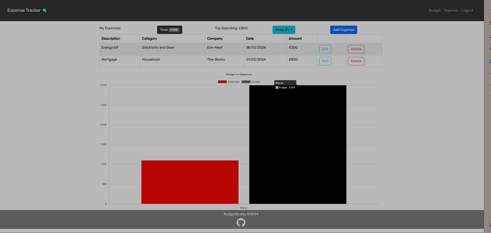

# expenseTracker

# Description

As a Financially inteligent person, i want to be able to track my daily, weekly and monthly expenses, to help me in my monthly budget. Once you signUp for this app, it allows you to stay in the loop and take control of your economy. It offers the possibilities for users to keep track of where they are spending most money.

<br>
ExpenseTracker is a web application that helps users track their expenses efficiently. It provides features for users to log their spending, manage their budget, and view insightful charts related to their spendings. Users can sign up, log in, log spending, view spending data, manage their budget, and perform various CRUD operations on their expenses. <br>

## Screen-shot of expense page



## Table Of Contents

- [Installation](#installation)
- [Usage](#usage)
- [Technologies Used](#technologies-used)
- [Deployment](#deployment)
- [Contributing](#contributing)
- [Credits](#credits)

## Installation

- The app was developed with MERN Stack, which stands for MongoDB, Express, React and Node. <br>

To install ExpenseTracker, follow these steps:

1.  Clone this repository from GitHub to your local Machine:

```bash
git clone git@github.com:BudgetBuddy887/expenseTracker.git
```

2. Navigate to project directory:

```bash
cd expenseTracker
```

3. install all the required npm packages

```
-cd into client folder and run npm install.
-cd out to global and run npm install && npm run develop, to install the necessary dependencies, and start the app
```

## Usage

Upon landing on the ExpenseTracker homepage, you will see a display of money saving tips and options to log in or sign up.

Click on the Login/Signup menu option to open a modal with a toggle between login and signup options.

If you choose Signup, enter your username, email address, and password, and click the signup button to create your account.

If you choose Login, enter your email address and password, and click the login button to access your account.

Once logged in, you will have access to four modals: Homepage, Budget, Log Spending, and View Spending.

Click on the Budget option to view a table with columns for Income and Expenditure. You can add, delete, and update your income and expenses.

Select Log Spending to open a window where you can perform CRUD operations on your spendings.

Choose View Spending to see charts associated with your spendings.

Click on the Logout button to log out of the site and return to the Homepage.

## Technologies Used

```bash

- **Frontend**: VITE, REACT, Chart.JS, FRAMER, JavaScript, Chakra Ui
- **Backend**: Node.js, Apollo Server, Express.js.
- **Database**: MongoDB
- **Template-Engine**:GraphQL
```

```bash
Ensure that these dependencies are available in Package.json
- "@apollo/client": "^3.7.14",
- "@apollo/react-hooks": "^4.0.0",
- "@chakra-ui/react": "^2.8.2",
- "@emotion/react": "^11.11.4",
- "@emotion/styled": "^11.11.0",
- "bootstrap": "^5.2.3",
- "chart.js": "^4.4.2",
- "framer-motion": "^11.0.13",
- "graphql": "^16.6.0",
- "jwt-decode": "^3.1.2",
- "react": "^18.2.0",
- "react-bootstrap": "^2.7.4",
- "react-chartjs-2": "^5.2.0",
- "react-dom": "^18.2.0",
- "react-router-dom": "^6.11.2"
- "@chakra-ui/react": "^2.8.2",
- "@emotion/react": "^11.11.4",
- "@emotion/styled": "^11.11.0",
- "apollo-server-express": "^3.13.0",
- "chart.js": "^4.4.2",
- "framer-motion": "^11.0.15"
```

## Deployment

This application is deployed on Render. Checkout the live application [here](https://budgetbuddytracker.onrender.com/)

## Contributing

Contributions to improve expenseTracker are welcome. Please ensure to update tests as appropriate.

## Credits

**Mustafa D. Sigad**

- Github:[@mustafasigad](https://github.com/mustafasigad)

**Lalita Kapadia**

- Github: [@lalitakapadia](https://github.com/lalitakapadia)

**Ben Lealan**

- Github: [@BLealan](https://github.com/BLealan)

**Obiora Ezeasor Nwosu**

- Guthub: [@Obi1knube](https://github.com/Obi1knube)

**Yasir Jamar**

- GitHub: [@yasirjamah123](https://github.com/yasirjamah123)

**Luis Moore**

- Guthub: [@LuisM1874](https://github.com/LuisM1874)

**Abdul Youssef**

- Github [@AbdulYossef](https://github.com/AbdulYossef)

**Ali Kocaman**

- Github [@KDragonuv](https://github.com/KDragonuv)
