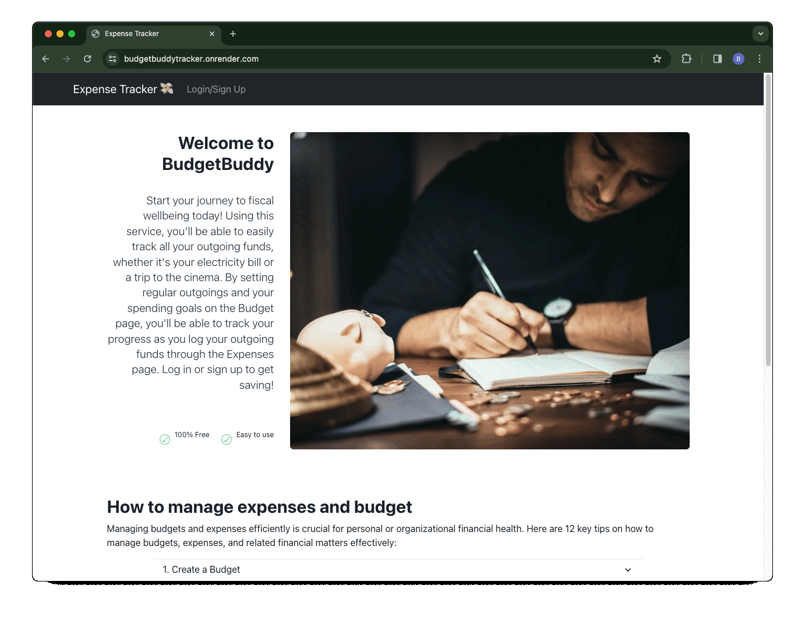

# expenseTracker

## Description

As a financially intelligent person, I want to be able to track my daily, weekly and monthly expenses, to help me with my monthly budget. ExpenseTracker is a web application that helps users track their expenses efficiently. It provides features for users to log their spending, manage their budget, and view insightful charts related to their spending. After users sign up or log in, they can log their spending, view and edit data, consequently helping them to stay in the loop and take control of their budget!

## Screenshots of site



## Table Of Contents

- [Installation](#installation)
- [Usage](#usage)
- [Technologies Used](#technologies-used)
- [Deployment](#deployment)
- [Contributing](#contributing)
- [Credits](#credits)
- [Sources](#sources)

## Installation

The app was developed following the MERN Stack, which stands for MongoDB, Express, React and Node. <br>

To install ExpenseTracker, follow these steps:

1.  Clone this repository from GitHub to your local machine:

```
git clone git@github.com:BudgetBuddy887/expenseTracker.git
```

2. Navigate to project directory:

```
cd expenseTracker
```

3. Install all the required npm packages and compile scripts

```
- npm install
- npm run develop
```

4. The app will run on `http://localhost:3000/` while GraphQL can be accessed on `http://localhost:3001/graphql`

## Usage

Upon landing on the ExpenseTracker homepage, you will see a display of money saving tips and options to log in or sign up.

Click on the Login/Signup menu option to open a modal with a toggle between login and signup options.

If you choose Signup, enter your username, email address, and password, and click the signup button to create your account.

If you choose Login, enter the email address and password used to signup, and click the login button to access your account.

Once logged in, you will now have access to "Budget" and "Spending", where you can log, view, edit and delete data.

On the "Expenses" page you can click "Financial Health Chart" to see charts associated with your spending and budget.

Once finished click on the Logout button to log out of the site and return to the Homepage.

## Technologies Used

```
- **Frontend**: VITE, REACT, Chart.JS, FRAMER, JavaScript, Chakra Ui
- **Backend**: Node.js, Apollo Server, Express.js.
- **Database**: MongoDB
- **Template-Engine**:GraphQL
```

Ensure that these dependencies are available in root package.json
```
- "@apollo/client": "^3.7.14",
- "@apollo/react-hooks": "^4.0.0",
- "@chakra-ui/react": "^2.8.2",
- "@emotion/react": "^11.11.4",
- "@emotion/styled": "^11.11.0",
- "bootstrap": "^5.2.3",
- "chart.js": "^4.4.2",
- "framer-motion": "^11.0.13",
- "graphql": "^16.6.0",
- "jwt-decode": "^3.1.2",
- "react": "^18.2.0",
- "react-bootstrap": "^2.7.4",
- "react-chartjs-2": "^5.2.0",
- "react-dom": "^18.2.0",
- "react-router-dom": "^6.11.2"
- "@chakra-ui/react": "^2.8.2",
- "@emotion/react": "^11.11.4",
- "@emotion/styled": "^11.11.0",
- "apollo-server-express": "^3.13.0",
- "chart.js": "^4.4.2",
- "framer-motion": "^11.0.15"
```

## Deployment

This application is deployed on Render. Check out the live application [here](https://budgetbuddytracker.onrender.com/)

## Contributing

Contributions to improve ExpenseTracker are welcome. Please ensure to update tests as appropriate.

## Credits

Click on our names to view our GitHub pages!

[**Yasir Jamar**](https://github.com/yasirjamah123)

[**Lalita Kapadia**](https://github.com/lalitakapadia)

[**Ali Kocaman**](https://github.com/KDragonuv)

[**Ben Lealan**](https://github.com/BLealan)

[**Luis Moore**](https://github.com/LuisM1874)

[**Obiora Ezeasor Nwosu**](https://github.com/Obi1knube)

[**Mustafa D. Sigad**](https://github.com/mustafasigad)

[**Abdul Youssef**](https://github.com/AbdulYossef)


## Sources

- Image for home page found [here](https://www.pexels.com/photo/focused-man-writing-in-account-book-at-table-7063776/)
- Code block to display image in Chakra UI from [here](https://templateskart.com/components/heroes)
